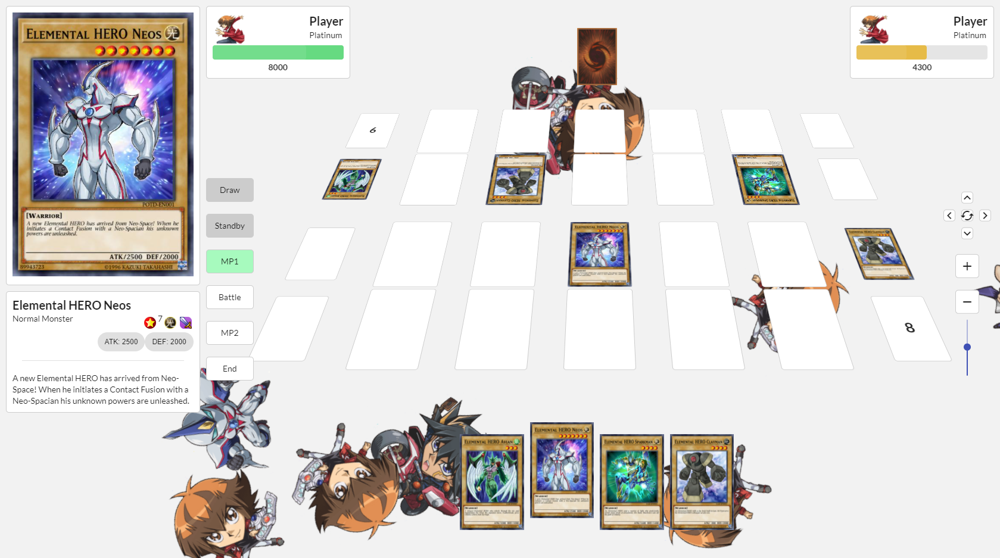

 

# Yu-Gi-Oh multiplayer web game & framework - Developing

Author: Ruiqi (Ricky) Peng

A realization of the popular trading card game - yugioh on web using React + Node. The project includes a completely remade engine to contain the game logic, a multiplayer functionality using websocket, and interfaces to create custom cards using Javascript. 

That's right, no ygocore and its Lua card scripts but a completely new Yugioh simulator written in Javascript. You can also access its desktop version just by wrapping the source code with some simple tweaks using Electron (just git checkout the `electron` branch lol)!

## Installation for Development
1. `git clone https://github.com/rickypeng99/yugioh_web_server.git`
2. Change directories to `./yugioh_web_server`
3. Command: `npm install`
4. `git clone https://github.com/BBeretta/yugioh_web.git`
4. Change directories to `./yugioh_web`
5. Command: `npm install`

## Running Server
1. Open terminal window
2. Change directories to `./yugioh_web_server`
3. Command: `node index.js`

## Running the web app
1. Open two terminal windows up and run the following in each of them
2. Change directories to `./yugioh_web`
3. Command: `npm start`

## Updates (As of February 21st 2023):
- Updated dependencies for the file to work correctly.

## Tech Stack
| Software Tool | Target Version |
| --- | --- |
| Node.js | 18.12.1 |
| npm | 9.1.2 |
| mui/material | 5.11.10 |
| react | 18.2.0 |
| react-dom | 18.2.0 |
| react-redux | 8.0.5 |
| react-scripts | 5.0.1 |
| react-sky | 1.1.0 | --force (not compatible for React^18)
| react-transition-group | 4.4.5 |
| redux | 4.2.1 |
| semantic-ui-css | 2.5.0 |
| semantic-ui-react | 2.1.4 |
| socket.io-client | 4.6.1 |

## Works done (As of April 17th 2021):
 - Multiplayer: You can play this game against other players online! (Not actually cuz I haven't deployed my node.js code yet but you can checkout [ygo_web_server](https://github.com/rickypeng99/yugioh_web_server))
 - Playmat: You can flip the playmat around x-axis, move it to different directions and change its size.
 - Detail: You can view a particular card's detail concisely in the left panel
 - Summoning monsters: Now supports normal, set and tribute summons!
 - Phase changing: Complete and synchronous phase changing between the two players
 - Health bar: Yea it's functioning during battles
 - Effect: Partially developed; I have designed and implemented the basic effect activation & chaining logics between two players (Here is the screen capture of me using polymerization!)
 
 - Battle: Complete support and animation of all kinds of battles
 

 ## Outdated recording of an early version
  (I am too lazy to prvide a Gif of every aspect of the current gameplay. You can access more screenshots of early versions in the `screenshots` folder tho)
  
