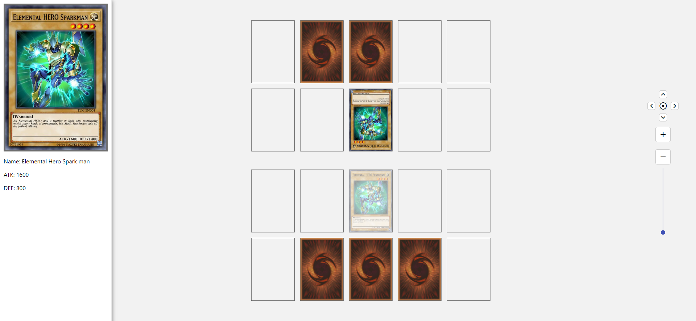
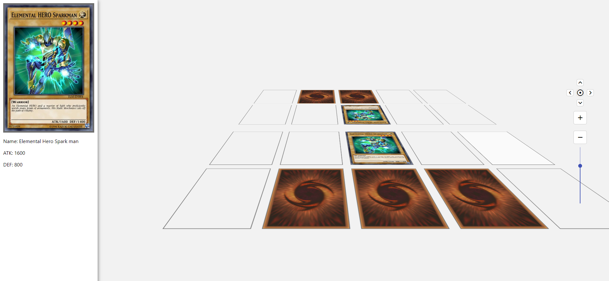

# Yu-Gi-Oh multiplayer web game & framework - Developing
A realization of the popular trading card game - yugioh on web using React.js. The project includes a completely remade engine, a multiplayer functionality (currently planning to utilize websocket) and interfaces to create custom cards using Javascript.

## Works done (As of March 3rd 2021):
 - Playmat: You can rotate over x-axis, move it to different directions and change its size.
 - Detail: You can view a particular card's detail concisely in the left panel
 - Summoning monsters: Now supports normal summon, set and tribute summon methods!
 - Phase changing: Developing
 - Health bar: Developing
 - Effect: Developing
<!-- 

 -->
